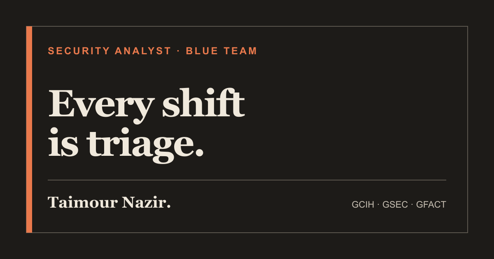

# Taimour Nazir — Cybersecurity Portfolio

> **Every shift is triage.**

I am a GIAC-certified security analyst (GCIH, GSEC, GFACT) bringing seven years of 24/7 operational leadership at Amazon into blue-team security. My work focuses on investigation discipline, detection development, clear severity decisions, and concise handoffs under pressure.

## View the portfolio

### [taimournazir.github.io →](https://taimournazir.github.io/)

The portfolio documents my security projects, independently created lab work, professional background, toolkit, and verified credentials.

## Current focus

- Expanding a home SOC lab with Active Directory and generating original Kerberoasting and DCSync telemetry for investigation and detection validation.
- Building cloud-investigation depth across IAM, CloudTrail, GuardDuty, Detective, Security Hub, and VPC Flow Logs.
- Practising alert triage, Windows and network forensics, SIEM analysis, and incident reporting through the Hack The Box CDSA path.

## Featured projects

- **Home SOC lab:** A four-VM Windows, Linux, attacker, and analyst environment that sends telemetry to both Splunk and Elastic.
- **Detection notebook and ATT&CK coverage map:** Structured SPL and KQL records covering log sources, blind spots, false positives, validation, and ATT&CK mapping.
- **Operational anomaly analytics platform:** A shipped Python, Streamlit, SQLite, and pandas workflow demonstrating transferable detection-engineering principles without exposing employer data.

[Explore the projects →](https://taimournazir.github.io/projects/)

## Credentials

GCIH · GSEC · GFACT · CompTIA Security+ · ISC2 Certified in Cybersecurity · Google Cybersecurity Professional Certificate

[View certifications and verification links →](https://taimournazir.github.io/about/#certifications)

## Publication standard

Portfolio material is written from my own experience and independently generated practice. Technical evidence is created in controlled labs or with synthetic/public data. I do not publish SANS courseware, book or workbook material, answer keys, proprietary lab instructions, employer-confidential information, internal screenshots, source code, or operational data.

## Site

Built with Jekyll and hosted on GitHub Pages. The repository includes responsive and accessible templates, dark-mode styling, metadata, RSS, sitemap, robots directives, and explicit draft filtering.

## Connect

- [LinkedIn](https://www.linkedin.com/in/taimournazir)
- [GitHub](https://github.com/taimournazir)
- [Credly](https://www.credly.com/users/taimour-nazir)

